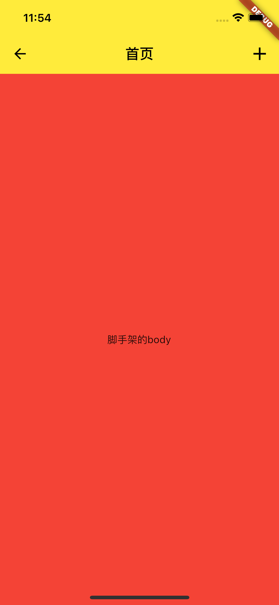

1、构建UINavigationController

```Dart
import 'package:flutter/material.dart';

class ScaffoldDemo extends StatelessWidget {
  const ScaffoldDemo({Key? key}) : super(key: key);
  
  @override
  Widget build(BuildContext context) {
    return Scaffold(
      // 导航栏（相当于UINavigationBar，甚至更强大）
      appBar: AppBar(
        //导航栏标题
        title: Text("首页", style: TextStyle(fontSize: 20, color: Colors.black)),
        //导航栏阴影
        elevation: 0.0,
        //设置导航栏背景颜色
        backgroundColor: Colors.yellow,
        //是否居中显示，设置该属性可保证iOS、Android、web显示的样式一致
        centerTitle: true,
        // 导航栏左侧控件，相当于leftBarButtonItem（返回按钮）
        leading: Container(child: Icon(Icons.arrow_back)),
        // 导航栏右侧按钮，相当于rightBarButtonItems
        actions: [Container(
            padding: EdgeInsets.only(right: 12),
            child: Icon(Icons.add, size: 30),
          )],
      ),
      // 脚手架的body
      body:Container(child: Center(child: Text("脚手架的body")), color: Colors.red),
    );
  }
}
```


<!--  -->


2、页面跳转
```Dart
// 脚手架的body
body: Center( child: ElevatedButton(
  child: Text("点击跳转"),
  //点击事件回调
  onPressed: () {
   	// 使用Navigator进行回调
    Navigator.of(context).push(
      MaterialPageRoute(builder: (BuildContext context) {
        return DetailPage();
      }),
    );
  },
)),
```